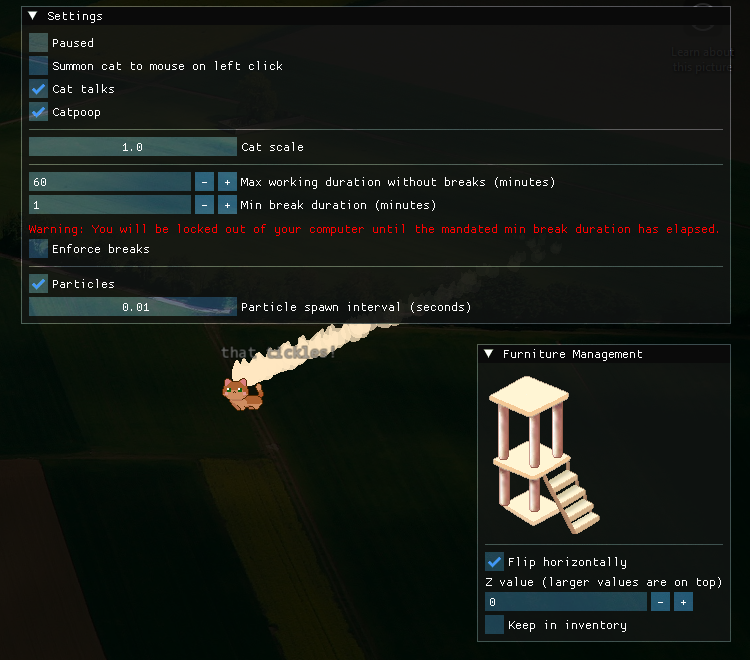

# Desktop Companion

## Introduction

<iframe width="560" height="315" src="https://www.youtube.com/embed/v-0bdggoRfw?si=-0Qre_Ah60YiKrRf" title="YouTube video player" frameborder="0" allow="accelerometer; autoplay; clipboard-write; encrypted-media; gyroscope; picture-in-picture; web-share" referrerpolicy="strict-origin-when-cross-origin" allowfullscreen></iframe>

Desktop Companion provides a cute cat to accompany you on your daily tasks. It gets happy or sad depending on if you have taken a break from your computer.

Through taking breaks punctually, you can earn coins, which can be used to purchase skins or furnitures to renovate your companion's room!

This is what your cat's room can look like!

You can either manage the furnitures too! Flip them, put them on top of each other, or store it in inventory for later use. This also shows the settings config of the application, where you can actually allow this program to enforce the breaks you take

If you have not taken a break in the predefined time, and enforce breaks is turned on. You will not be allowed to do anything until the break time is over. However, if you urgently need to access to your computer, you can enter `I am done with my break` to end the enforced break.

There are many more hidden features and secrets to discover, so try it!

## Download

[Download latest release](https://github.com/jspoh/desktop-companion/releases/latest) 

## Usage

use ` or ~ to open cat room and settings 

## Cheat codes

`kaching` - adds money

`exit` - bypasses the enforced break lock

### Problem impact

## Solution 

### Top incentives

### Demand/desire for a desktop companion solution

### App annoyances

### Target platform

### Prompt frequency

