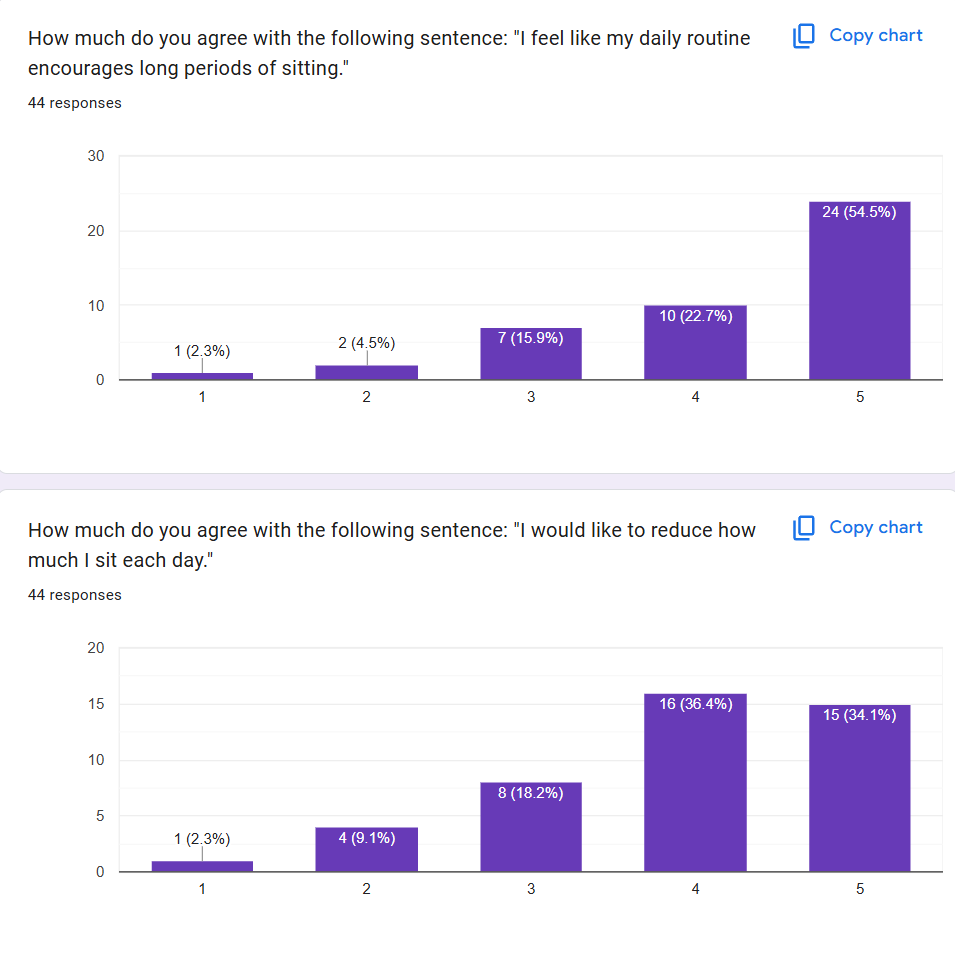
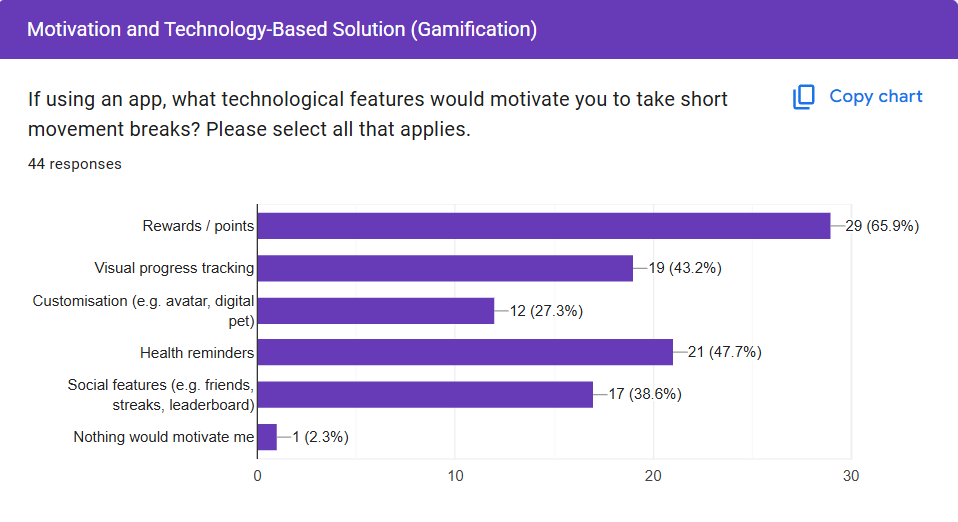
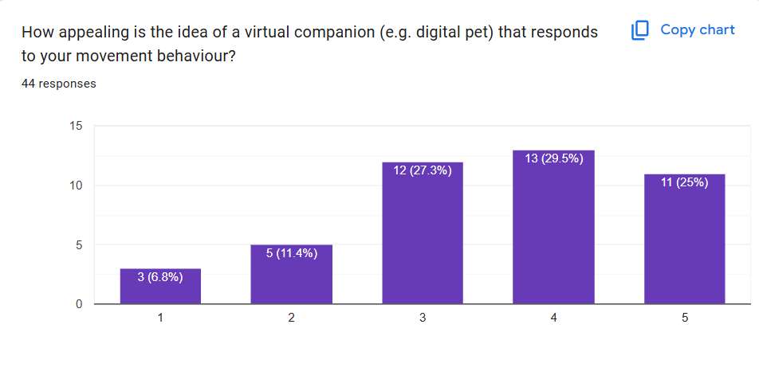
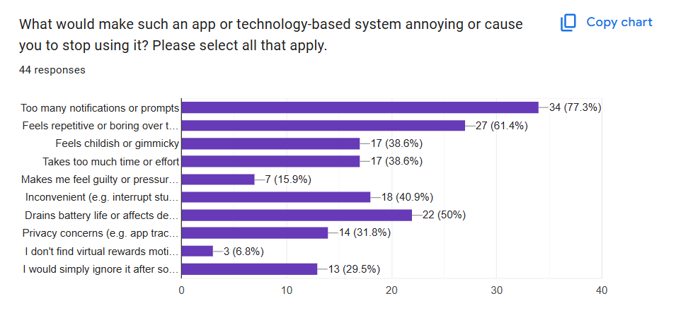
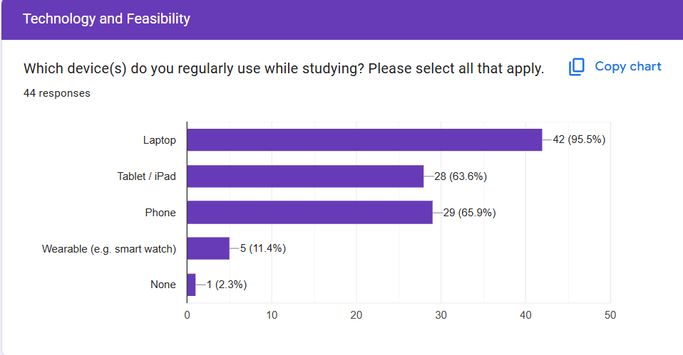

# Desktop Companion

## Usage

use ` or ~ to open cat room and settings 

## Cheat codes

`kaching` - adds money

`exit` - bypasses the enforced break lock

### Problem impact

## Solution 

### Top incentives

### Demand/desire for a desktop companion solution

### App annoyances

### Target platform

### Prompt frequency

